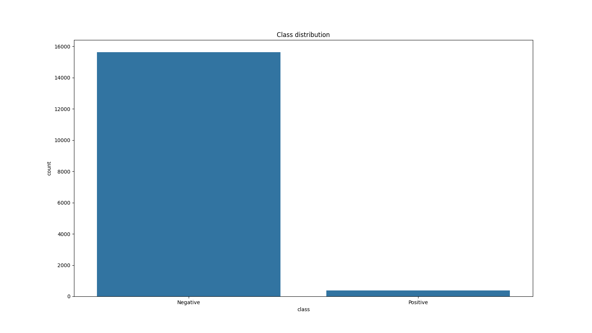
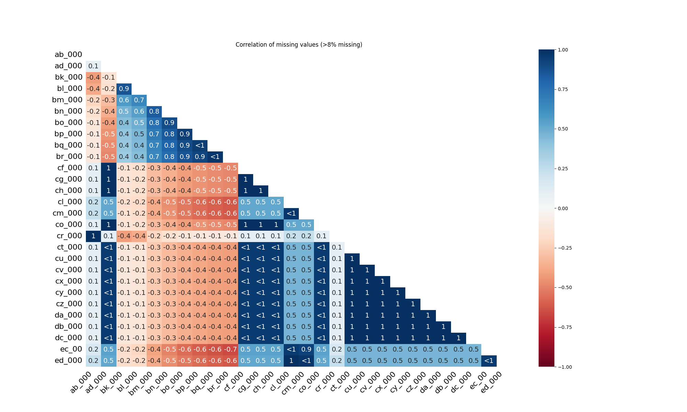
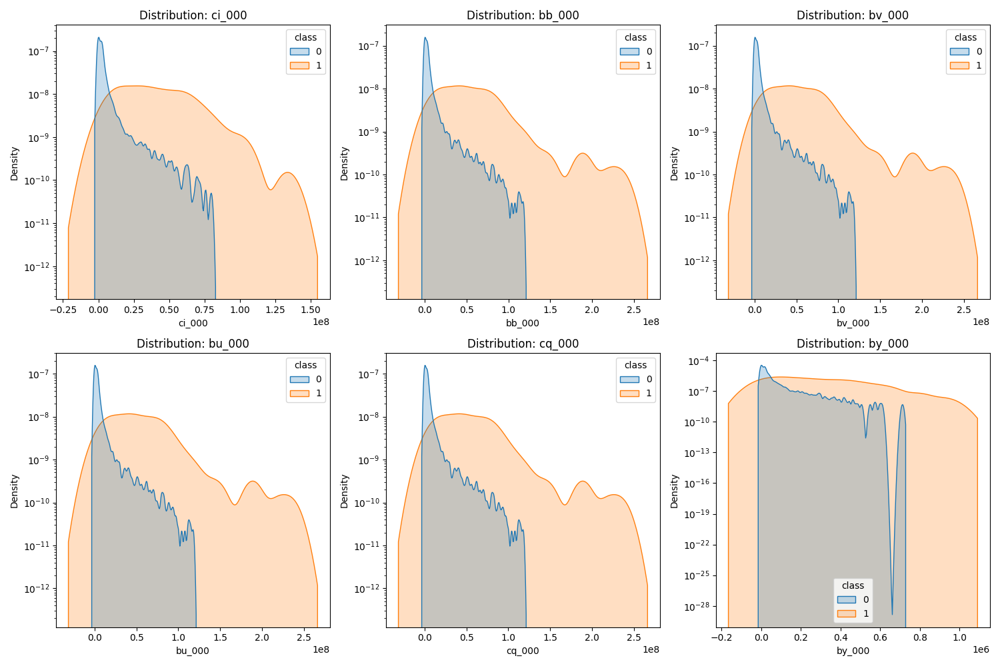
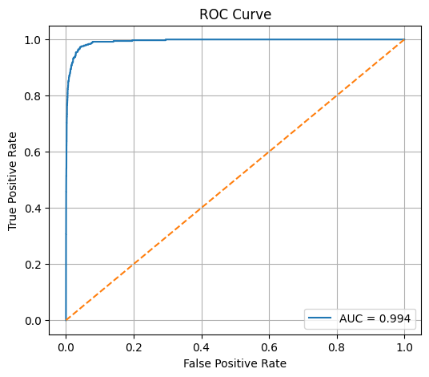

# Project Summary: Scania APS Failure Prediction

## 1. Exploratory Data Analysis (EDA)

The initial analysis revealed several critical characteristics of the APS failure dataset that heavily influenced our preprocessing and modeling strategy.

### Class Imbalance

The dataset exhibits **extreme class imbalance**, with positive cases (failures) making up only **~2.34%** of the total samples.

- **Negative Class (0):** 97.66%
- **Positive Class (1):** 2.34%
- **Impact:** Standard accuracy is a misleading metric here. We must prioritize **Recall** and use cost-sensitive learning (`class_weight='balanced'`) to ensure failures are not overlooked.

  

### Missing Data Patterns

Data is not missing completely at random (MCAR).

- **Correlated Blocks:** Heatmap analysis reveals that missing data often occurs in blocks across multiple sensors simultaneously. This suggests that certain subsystems fail or report as a group.
- **Strategy:** We removed columns with >50% missing values. For the rest, **Median Imputation** was chosen over Mean due to the heavy skewness of the distributions.

  

### Distribution and Skewness

Most features are highly skewed and dominated by extreme outliers, as seen in the log-scale distributions of top features.

- **High Skewness:** Top features like `bu_000` (6.38) and `cq_000` (6.22) show massive variance.
- **Outlier Dominance:** The presence of extreme values necessitates **Robust Scaling** or standardization to prevent outliers from distorting the model's learning process.

<h3 align="center">Feature Distributions (Log-Scale)</h3>

  

<i>Distribution plots confirm that failures (Class 1) often occupy a distinct, broader range compared to the concentrated peaks of operational states (Class 0).</i>

### Feature Redundancy

Correlation analysis shows that several sensors are nearly perfectly correlated (e.g., `bv_000` and `bu_000`).

- **Impact:** This high redundancy justifies our use of **PCA** later in the pipeline to reduce dimensionality while preserving signal.

## 2. Methodology & Feature Engineering

### Preprocessing Pipeline

To prepare the raw data for modeling, the following steps were implemented:

- **Missing Value Removal:** Dropped columns where more than 50% of values were missing to ensure data quality.
- **Imputation:** Applied median imputation to fill remaining gaps, preserving the central tendency of features.
- **Feature Cleaning:** Removed features with near-zero variance and those with extremely high correlation to reduce redundancy.
- **Scaling:** Standardized features to bring all variables to a common scale.

### Feature Selection Benchmark

We conducted a benchmark of three selection techniques to identify the most effective feature subset:

| Method              | Type         | Feature Count | F1 Score (Mean) | F1 Score (Std) |
| :------------------ | :----------- | :------------ | :-------------- | :------------- |
| **Lasso Selection** | **Embedded** | **48**        | **0.80019**     | 0.01457        |
| RFE                 | Wrapper      | 50            | 0.79370         | 0.01268        |
| All Scaled Features | -            | 123           | 0.78209         | 0.00912        |
| Mutual Information  | Filter       | 50            | 0.76312         | 0.01087        |

**Conclusion:** Lasso (L1 regularization) was selected as it achieved the highest F1 score with a lean feature set.

### Final Pipeline Execution

- **Initial State:** 170 features.
- **Feature Selection (Lasso L1):** Reduced the set to **48 key features** by penalizing less informative variables.
- **Dimensionality Reduction (PCA):** Further compressed the data into **36 principal components**, maintaining high variance coverage while reducing noise (explained variance: 95.74%).
- **Class Imbalance:** Handled using `class_weight="balanced"` and `scale_pos_weight` to account for the rarity of failures.

## 3. Model Comparison

Models were initially evaluated using standard ROC-AUC, but the final selection was based on the **Total Scania Cost Metric** ($10 \times FP + 500 \times FN$).

### Initial Benchmark (Default Thresholds)

| Model               | ROC AUC    | Total Cost ($) |
| :------------------ | :--------- | :------------- |
| Logistic Regression | 0.9887     | 16,180         |
| Random Forest       | 0.9929     | 39,710         |
| **XGBoost (Tuned)** | **0.9939** | **35,670**     |

## 4. Threshold Optimization (Final Results)

Since the cost of a missed failure ($500) is 50 times higher than a false alarm ($10), we shifted the decision thresholds to prioritize **Recall**.

| Model               | Optimal Threshold | Minimal Cost ($) |
| :------------------ | :---------------- | :--------------- |
| **Random Forest**   | **0.089**         | **10,800**       |
| Logistic Regression | 0.376             | 13,190           |
| XGBoost             | 0.010             | 14,010           |

### Key Findings:

- **Random Forest** emerged as the winner after optimization. By lowering the threshold to **0.089**, we significantly reduced the number of costly undetected failures.
- **XGBoost** had the highest raw ROC-AUC (0.9944), but in this specific cost-sensitive scenario, Random Forest provided a more stable cost-reduction profile.
- **Logistic Regression** performed surprisingly well in terms of cost ($13,190) due to its high native Recall (0.936).

## 5. Visualizations

### Model Performance (ROC Curve)

The XGBoost model shows excellent class separation with an AUC of 0.994.

  

### Cost Optimization

The following chart illustrates how the total cost reaches its minimum at the 0.08 threshold for the Random Forest model.

  

### Final Confusion Matrix (Adjusted)

By adjusting the threshold, we significantly minimize False Negatives, which are the primary cost drivers in this project.

  

## 6. Final Conclusions

The project successfully demonstrates how machine learning can be translated into significant operational savings for fleet management.

### 6.1 The Winning Model: Random Forest

While **XGBoost** achieved the highest overall predictive power (ROC-AUC: 0.9944), **Random Forest** proved to be the superior choice for this specific business application. After shifting the decision threshold to **0.089**, it achieved:

- **Lowest Total Cost:** $10,800 (compared to $14,010 for XGBoost and $13,190 for Logistic Regression).
- **High Operational Safety:** By prioritizing Recall, we successfully minimized the most expensive failures ($500/case).
- **Robustness:** Random Forest showed a more stable cost-reduction profile when dealing with the extreme outliers and skewness identified during EDA.

### 6.2 Key Takeaways

- **Financial Efficiency:** We reduced potential operational risk costs by **72%** (from $39,710 to $10,800) through threshold tuning.
- **Metric Importance:** This project proves that in asymmetric cost scenarios, **Recall and Custom Cost Metrics** are far more valuable than simple Accuracy or even ROC-AUC.
- **Dimensionality Success:** Our pipeline (Lasso -> PCA) effectively compressed the data from 170 to 36 features without losing the signal necessary to detect critical failures.

### 6.3 Future Recommendations

- **Cost-Sensitive Learning:** Further research into incorporating the 50:1 cost ratio directly into the model's loss function could shave off the remaining $10,800.
- **Real-time Monitoring:** Implementing this model as a real-time service would allow Scania to trigger maintenance alerts before a breakdown occurs on the road.

---

_Developed as a final project for the Bootcamp AI 2025 by DeepDive._
